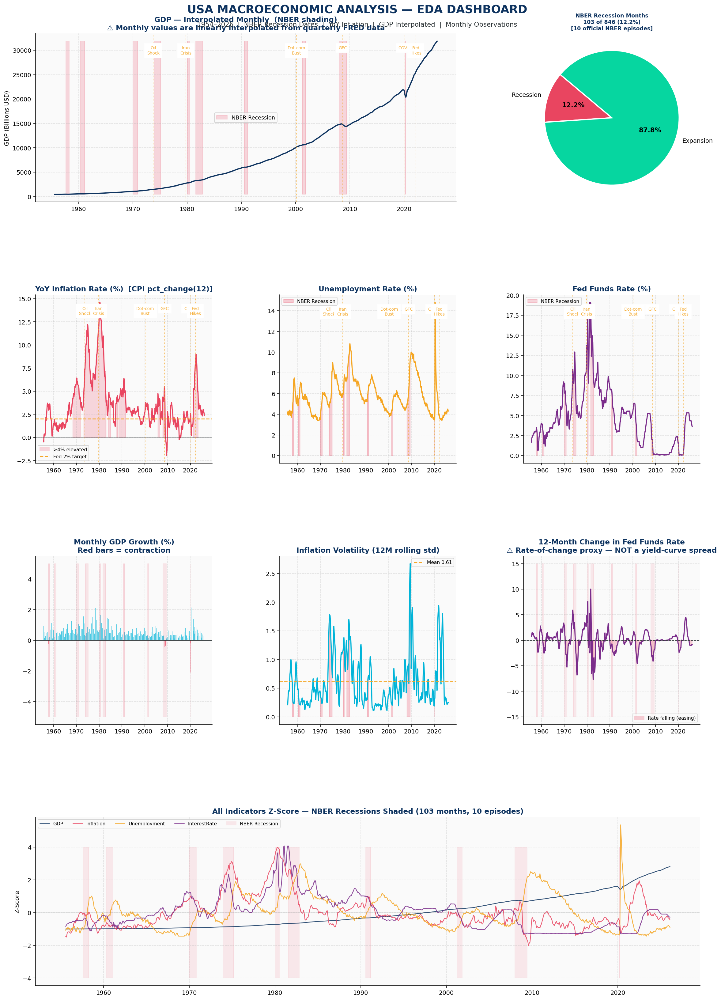
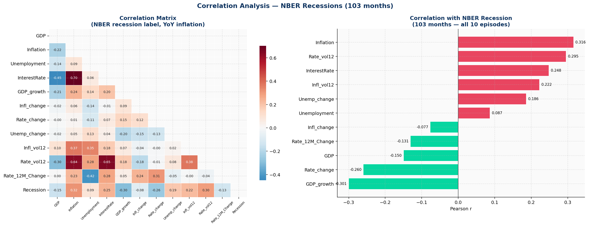
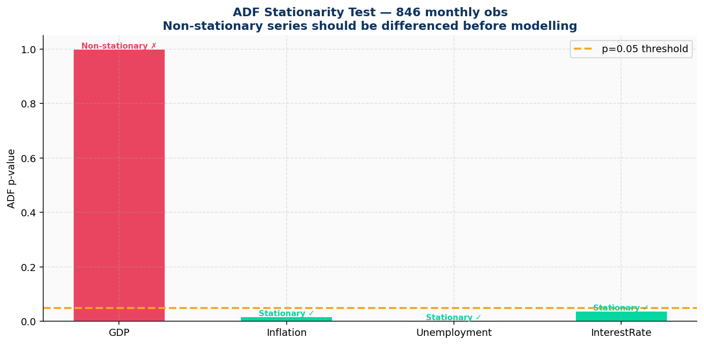
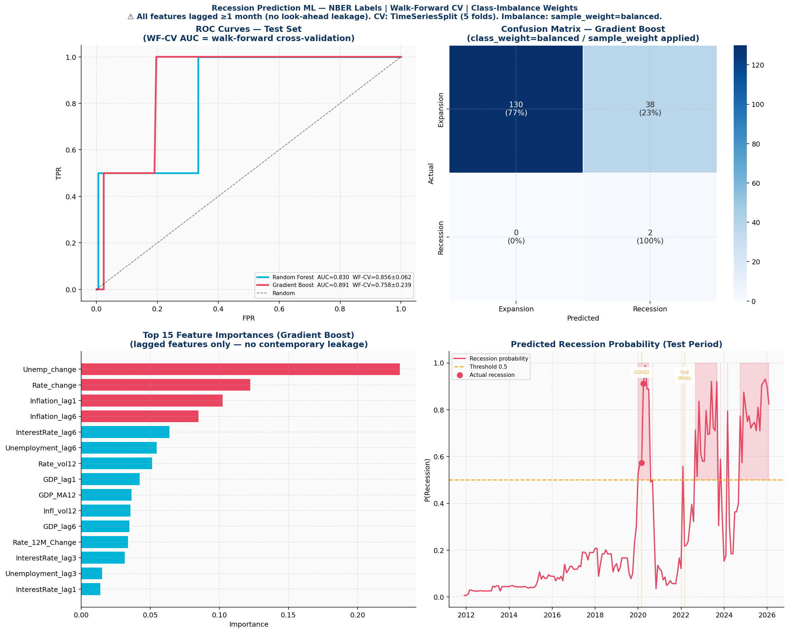
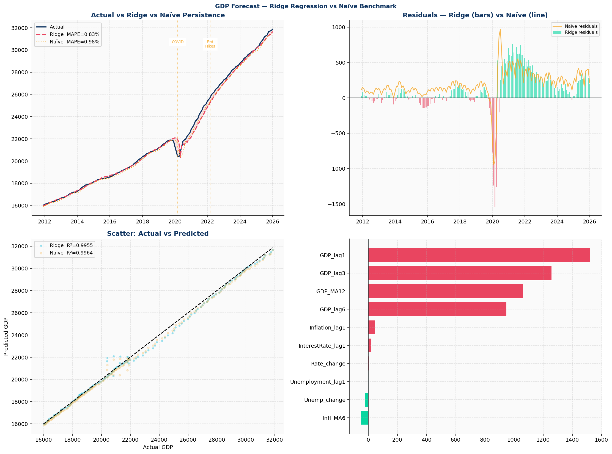
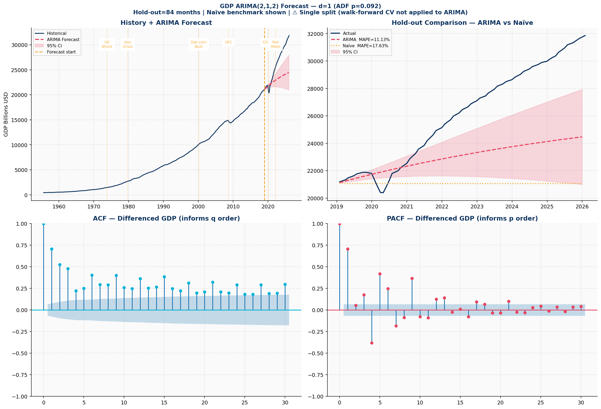
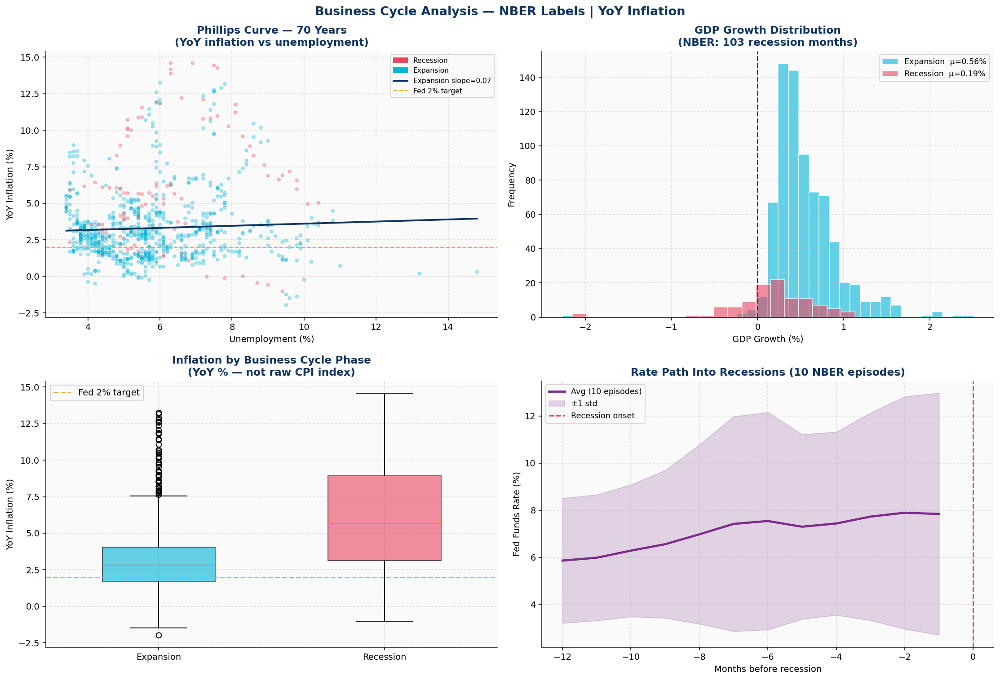

# 🇺🇸 USA Macroeconomic Analysis (1954–2026)

> End-to-end macroeconomic analytics project using 846 monthly U.S. observations (1954–2026). The project combines exploratory data analysis, statistical testing, machine learning-based recession prediction, GDP forecasting, and business cycle analysis using official NBER recession dates.


---

## 📊 All Output Charts

| | |
|:---:|:---:|
|  **EDA Dashboard** |  **Correlation Analysis** |
|  **ADF Stationarity** |  **Recession ML** |
|  **GDP Ridge Forecast** |  **ARIMA Forecast** |
|  **Business Cycle** | |

---

## 📁 Project Structure

```
usa-macro-analysis/
├── macroeconomic_analysis.py     # Main analysis script
├── GDP.csv                       # FRED: Real GDP (quarterly → interpolated monthly)
├── CPIAUCSL.csv                  # FRED: CPI All Urban Consumers
├── FEDFUNDS.csv                  # FRED: Federal Funds Effective Rate
├── UNRATE.csv                    # FRED: Unemployment Rate
├── outputs/
│   ├── macro_01_eda.png          # EDA dashboard (8 panels)
│   ├── macro_02_correlation.png  # Correlation matrix + recession bar chart
│   ├── macro_03_stationarity.png # ADF stationarity test results
│   ├── macro_04_recession_ml.png # ML recession prediction
│   ├── macro_05_gdp_forecast.png # Ridge GDP forecast vs naïve baseline
│   ├── macro_06_arima.png        # ARIMA(2,1,2) GDP forecast + ACF/PACF
│   └── macro_07_business_cycle.png # Phillips curve, GDP distribution, rate path
├── requirements.txt
└── README_macroanalysis.md
```

---

## 🔑 Key Results

### Dataset
| Metric | Value |
|---|---|
| Total monthly observations | 846 |
| Date range | Jul 1955 → Jan 2026 |
| Recession months (NBER) | 103 (12.2%) |
| Expansion months | 743 (87.8%) |
| NBER episodes covered | 10 (1957–2020) |

### Stationarity — ADF Test
| Series | p-value | Result |
|---|---|---|
| GDP | 1.0000 | ❌ Non-stationary → differenced for ARIMA |
| Inflation | 0.0180 | ✅ Stationary |
| Unemployment | 0.0025 | ✅ Stationary |
| Interest Rate | 0.0375 | ✅ Stationary |

### Recession Prediction — Walk-Forward CV (5 folds, TimeSeriesSplit)
| Model | Test AUC | WF-CV AUC | Recall |
|---|---|---|---|
| **Gradient Boost** ⭐ | **0.8914** | 0.7583 ± 0.2387 | 1.000 |
| Random Forest | 0.8304 | 0.8558 ± 0.0616 | 0.500 |

> ⚠️ Only 2 recession months in the test period (COVID tail) — test-set recall/F1 are
> indicative only. **WF-CV AUC is the more reliable metric.**

### GDP Forecast
| Model | MAPE | Naïve Baseline | Beats Baseline? |
|---|---|---|---|
| Ridge Regression | 0.83% | 0.98% | ✅ Yes |
| ARIMA(2,1,2) | 11.13% | 17.63% | ✅ Yes |

> ⚠️ Ridge (1-month-ahead) and ARIMA (84-month-ahead) MAPEs are **not directly
> comparable** — longer horizons always produce higher MAPE.

### Top Recession Predictors (Pearson r with NBER label)
| Feature | r |
|---|---|
| Inflation | +0.316 |
| Rate Volatility 12M | +0.295 |
| Interest Rate | +0.248 |
| Inflation Volatility 12M | +0.222 |
| GDP Growth | −0.301 |

---
### 💡Key Insights

### Economic Insights
- Inflation and interest-rate volatility showed the strongest positive relationships with recession periods.
- GDP growth was negatively associated with recession periods.
- Recession months represented only 12.2% of observations, highlighting the difficulty of predicting rare economic events.

### Machine Learning Insights
- Gradient Boost achieved the highest hold-out recession prediction performance (AUC = 0.8914).
- Walk-forward validation was used to evaluate models using only historical information, reducing look-ahead bias.
- Severe class imbalance (12.2% recession observations) makes AUC a more informative metric than accuracy.

### Forecasting Insights
- Ridge Regression outperformed a naïve persistence benchmark for short-term GDP forecasting (MAPE 0.83% vs 0.98%).
- ARIMA(2,1,2) outperformed a naïve benchmark for long-horizon forecasting (MAPE 11.13% vs 17.63%).
- Forecasting performance demonstrates the predictive value of historical macroeconomic indicators.

---

## 🗂️ Data Sources

All data from [FRED — Federal Reserve Bank of St. Louis](https://fred.stlouisfed.org/):

| Series | FRED ID | Notes |
|---|---|---|
| Real GDP | `GDP` | Quarterly → linearly interpolated to monthly |
| CPI All Urban Consumers | `CPIAUCSL` | Converted to YoY % change |
| Unemployment Rate | `UNRATE` | Monthly |
| Federal Funds Effective Rate | `FEDFUNDS` | Monthly |

Recession dates: [NBER Business Cycle Dating Committee](https://www.nber.org/research/business-cycle-dating)

---

## ⚙️ Installation & Usage

### 1. Clone the repository
```bash
git clone https://github.com/<thushanij>/usa-macro-analysis.git
cd usa-macro-analysis
```

### 2. Install dependencies
```bash
pip install -r requirements.txt
```

### 3. Run the analysis
```bash
python macroeconomic_analysis.py
```

Output charts are saved automatically to the `outputs/` folder.

---

## 📦 Requirements

```
pandas
numpy
matplotlib
seaborn
scikit-learn
statsmodels
```

`requirements.txt`:
```
pandas>=1.5.0
numpy>=1.23.0
matplotlib>=3.6.0
seaborn>=0.12.0
scikit-learn>=1.1.0
statsmodels>=0.13.0
```

---

## 🧪 Analysis Pipeline

```
1. Load & Merge
   └── GDP (quarterly → monthly interpolation)
       + CPI → YoY Inflation
       + Unemployment Rate
       + Federal Funds Rate

2. NBER Recession Labels
   └── Official peak→trough for all 10 episodes (1957–2020)

3. Feature Engineering  [no look-ahead leakage]
   └── Lags: 1, 3, 6 months for all 4 indicators
   └── Rolling: MA6, MA12, vol12 (std)
   └── Momentum: diff(), diff(12)


4. EDA Dashboard            → macro_01_eda.png
   └── GDP, Inflation, Unemployment, Fed Funds Rate
   └── GDP Growth, Inflation Volatility, Rate Change, Z-Score

5. Correlation Analysis     → macro_02_correlation.png
   └── Full correlation matrix + recession bar chart

6. ADF Stationarity Tests   → macro_03_stationarity.png

7. Recession ML             → macro_04_recession_ml.png
   ├── Walk-forward CV: TimeSeriesSplit (5 folds)
   ├── Random Forest  (class_weight="balanced")
   └── Gradient Boost (sample_weight="balanced") ⭐ AUC=0.891

8. GDP Forecast — Ridge     → macro_05_gdp_forecast.png
   ├── Target = GDP(t+1), features = lagged values only
   └── Naïve persistence baseline: Ridge MAPE=0.83% vs Naïve=0.98%

9. ARIMA(2,1,2) Forecast    → macro_06_arima.png
   ├── 84-month hold-out with naïve benchmark
   └── ARIMA MAPE=11.13% vs Naïve=17.63%

10. Business Cycle          → macro_07_business_cycle.png
    ├── Phillips Curve (70 years, regime-mixing note)
    ├── GDP Growth Distribution: Expansion vs Recession
    ├── Inflation boxplot by business cycle phase
    └── Fed Funds Rate path into recessions (10 episodes avg)
```

---

## ⚠️ Limitations

| Area | Limitation |
|---|---|
| GDP monthly values | Linearly interpolated from quarterly FRED data — intra-quarter dynamics are synthetic |
| NBER recession labels | Published with a lag — not real-time signals |
| Rate_12M_Change | 12M change in Fed Funds — a rate-of-change proxy, **not** a yield-curve spread |
| ML test set | Only 2 recession months in test (COVID tail) — rely on WF-CV AUC, not test recall |
| Gradient Boost F1 | F1=0.095 despite Recall=1.0 — precision is low due to class imbalance in test set |
| Phillips Curve | Positive slope (+0.07) reflects 70-year regime mixing, not a causal relationship |
| ARIMA vs Ridge | Not directly comparable — different forecast horizons (84 months vs 1 month) |
| Models | Educational / analytical only — **not investment advice** |

---

## 📜 License

Released under the [MIT License](LICENSE).
Data from FRED is subject to [FRED's Terms of Use](https://fred.stlouisfed.org/legal/).

---

## 🙏 Acknowledgements

- [Federal Reserve Bank of St. Louis — FRED](https://fred.stlouisfed.org/)
- [NBER Business Cycle Dating Committee](https://www.nber.org/research/business-cycle-dating)
- [scikit-learn](https://scikit-learn.org/) · [statsmodels](https://www.statsmodels.org/) · [matplotlib](https://matplotlib.org/) · [seaborn](https://seaborn.pydata.org/)
